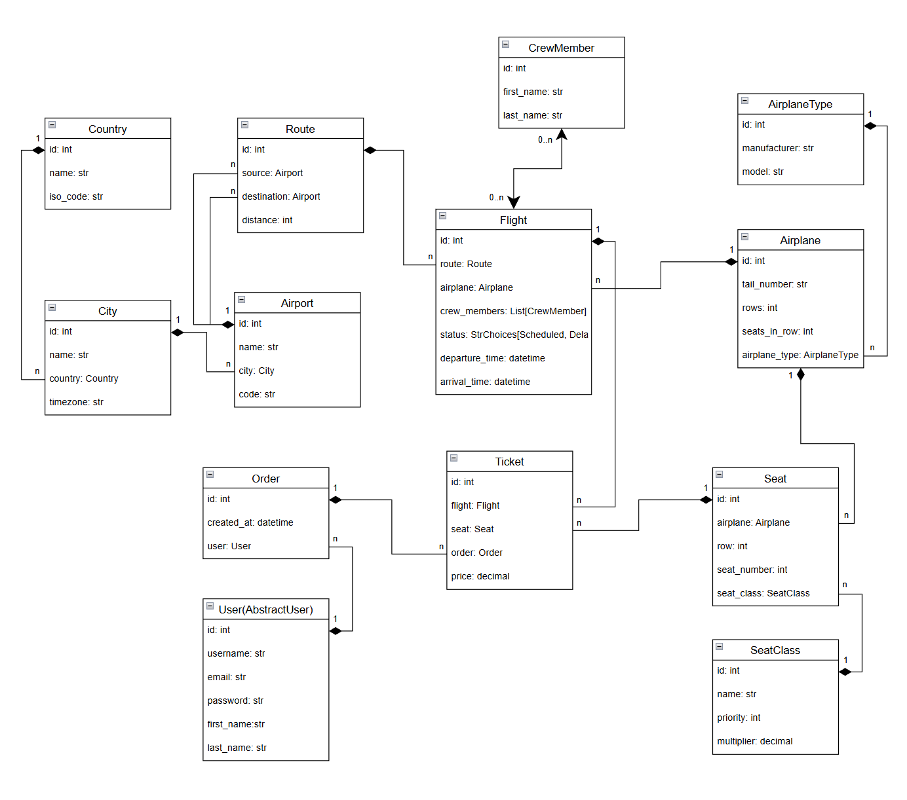

# Airport API

A Django REST Framework portfolio project: a full-featured API for managing airports, flights, airplanes, routes, and ticket orders. Built as a customizable DRF module project with JWT authentication, filtering, and custom business logic.

## Overview

This API serves as a backend for airport management systems. Users can browse flights, book tickets, and manage orders. Administrators can configure airports, routes, airplanes, and crew assignments.

The system handles:
- Flight scheduling with conflict detection
- Dynamic ticket pricing based on distance and seat class
- Timezone-aware departure filtering
- Automatic seat generation for new aircraft

## Features

### Core Functionality
- **Flights** - Search by origin, destination, date, or status. View available seats and capacity.
- **Tickets & Orders** - Book seats on scheduled flights. Prices calculate automatically.
- **Routes** - Define connections between airports with distances.
- **Airports & Cities** - Full geographic hierarchy with timezone support.
- **Airplanes** - Fleet management with automatic seat layout generation.
- **Crew** - Assign crew members to flights with overlap validation.

### API Capabilities
- JWT authentication with refresh tokens
- Role-based access (admin vs. authenticated users)
- Filtering on most endpoints (by ID, code, date range, price)
- Pagination with configurable limits
- OpenAPI documentation (Swagger UI and ReDoc)
- Request throttling (250/day anonymous, 1500/day authenticated)

## Custom Features

Beyond the base requirements, this implementation adds:

1. **Dynamic Pricing** - Ticket prices adjust based on route distance and seat class multiplier. Short-haul flights (< 500 km) cost 3x base rate; medium-haul (500-1500 km) cost 2x.

2. **Seat Class System** - First, Business, and Economy classes with configurable price multipliers (3x, 2x, 1x default).

3. **Automatic Seat Generation** - Creating an airplane generates its full seat layout. Rows 1-4 are First class, 5-10 Business, 11+ Economy.

4. **Timezone-Aware Filtering** - When filtering flights by date with a single origin city, the filter uses that city's local timezone.

5. **Conflict Detection** - The system prevents scheduling an airplane or crew member for overlapping flights.

6. **Tail Number Validation** - Aircraft registration numbers are validated against standard formats (e.g., SP-LOT, N12345).

7. **Booking Restrictions** - Users cannot book past flights or flights with non-scheduled status.

8. **Seed Command** - `python manage.py seed_data` creates demo users, sample flights, and test orders for development.

## Tech Stack

| Component | Technology |
|-----------|------------|
| Framework | Django 5.2, Django REST Framework 3.16 |
| Database | PostgreSQL 16 |
| Auth | JWT (SimpleJWT) |
| Docs | drf-spectacular (OpenAPI 3.0) |
| Container | Docker, Docker Compose |
| Python | 3.13 |

## Installation

### Using Docker (Recommended)

1. Clone the repository:
```bash
git clone https://github.com/your-username/airport-rest-api.git
cd airport-rest-api
```

2. Create `.env` file:
```env
SECRET_KEY=your-secret-key-here
POSTGRES_DB=airport
POSTGRES_USER=airport
POSTGRES_PASSWORD=airport
POSTGRES_HOST=db
POSTGRES_PORT=5432
PGDATA=/var/lib/postgresql/data

# Optional overrides for demo credentials (seed_data)
DJANGO_ADMIN_EMAIL=admin@demo.com
DJANGO_ADMIN_PASSWORD=admin12345
DJANGO_DEMO_EMAIL=demo@demo.com
DJANGO_DEMO_PASSWORD=demo12345
```

3. Build and run:
```bash
docker-compose up --build
```

4. (Optional) Seed demo data:
```bash
docker-compose exec airport python manage.py seed_data
```

The API runs at `http://localhost:8000`.

### Local Development

1. Create and activate a virtual environment:
```bash
python -m venv venv
source venv/bin/activate  # On Windows: venv\Scripts\activate
```

2. Install dependencies:
```bash
pip install -r requirements.txt
```

3. Set environment variables (see `.env` example above).

4. Run migrations:
```bash
python manage.py migrate
```

5. Start the server:
```bash
python manage.py runserver
```

## Authentication

The API uses JWT tokens. All write operations require authentication. Most read operations allow anonymous access.

1) Register: `POST /api/user/register/`  
2) Obtain token: `POST /api/user/token/`  
3) Use header:
```
Authorization: Bearer <access_token>
```

If you ran `seed_data`, you can log in as **demo user** (`demo@demo.com` / `demo12345`) and list orders/tickets to see the flow. Or as **admin user** (`admin@demo.com` / `admin12345`)

**Browsable API**: Open http://127.0.0.1:8000/api/airport/ in a browser;

---

### Token Lifetimes
- Access token: 10 minutes
- Refresh token: 3 days

### User Endpoints

| Endpoint | Method | Description |
|----------|--------|-------------|
| `/api/user/register/` | POST | Create new account |
| `/api/user/token/` | POST | Obtain token pair |
| `/api/user/token/refresh/` | POST | Refresh access token |
| `/api/user/token/verify/` | POST | Verify token validity |
| `/api/user/me/` | GET, PUT, PATCH | View/update current user |

## API Endpoints

Base URL: `/api/airport/`

| Resource | Endpoint | Methods | Auth Required |
|----------|----------|---------|---------------|
| Countries | `/countries/` | GET, POST, PUT, DELETE | Write: Admin |
| Cities | `/cities/` | GET, POST, PUT, DELETE | Write: Admin |
| Airports | `/airports/` | GET, POST, PUT, DELETE | Write: Admin |
| Routes | `/routes/` | GET, POST, PUT, DELETE | Write: Admin |
| Airplane Types | `/airplane_types/` | GET, POST, PUT, DELETE | Write: Admin |
| Airplanes | `/airplanes/` | GET, POST, PUT, DELETE | Write: Admin |
| Flights | `/flights/` | GET, POST, PUT, DELETE | Write: Admin |
| Crew Members | `/crew_members/` | GET, POST, PUT, DELETE | Read: Auth, Write: Admin |
| Seat Classes | `/seat_classes/` | GET, POST, PUT, DELETE | Write: Admin |
| Seats | `/seats/` | GET | Auth |
| Orders | `/orders/` | GET, POST | Auth |
| Tickets | `/tickets/` | GET | Auth |

### Filtering Examples

**Flights by origin city and date:**
```
GET /api/airport/flights/?origin=1&departure_date=2026-01-15
```

**Routes by airport codes:**
```
GET /api/airport/routes/?source_codes=WAW&destination_codes=LHR,JFK
```

**Tickets by price range:**
```
GET /api/airport/tickets/?price_min=100&price_max=500
```

**Available seats for a flight:**
```
GET /api/airport/flights/1/available_seats/
```

## Documentation

Interactive API documentation is available at:
- Swagger UI: `http://localhost:8000/api/doc/swagger/`
- ReDoc: `http://localhost:8000/api/doc/redoc/`
- OpenAPI Schema: `http://localhost:8000/api/doc/`

## Database Schema

The data model includes 12 entities:



## Demo Credentials

After running `seed_data`:

| Role | Email | Password |
|------|-------|----------|
| Admin | admin@demo.com | admin12345 |
| User | demo@demo.com | demo12345 |

## Project Structure

```
airport_rest_api/
├── airport/                 # Main app
│   ├── management/commands/ # seed_data, wait_for_db
│   ├── migrations/
│   ├── tests/               # 13 test modules
│   ├── models.py            # 12 models
│   ├── serializers.py       # List/Detail/Create serializers
│   ├── views.py             # ViewSets with filtering
│   ├── permissions.py       # Custom permission classes
│   └── utils.py             # Query parameter parsers
├── user/                    # Custom user model, JWT endpoints
├── airport_rest_api/        # Project settings
├── Dockerfile
├── docker-compose.yml
└── requirements.txt
```

## Testing

Run tests with:
```bash
python manage.py test
```

Or in Docker:
```bash
docker-compose exec airport python manage.py test
```

## License

This project is for educational and portfolio purposes.
